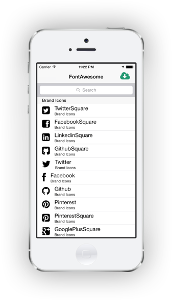

FontAwesomeComponent
====================

Font Awesome by Dave Gandy - http://fontawesome.io

Use fontawesome in your xamarin iOS apps. Icons are rendered at the correct dpi using packaged font file.

Example
=======

```csharp
rightNavButton = new UIBarButtonItem (FontAwesome.Touch.Icon.CloudDownload.ToUIImage(30), UIBarButtonItemStyle.Bordered, (s,e) =>{
});
```

Setup
=====

Nuget package comming soon!

* Build FontAwesome.iOS project, add you your app.

* Add font definition to the info.plist file. Note: the font is included within the
FontAwesome.Touch dll. (Working on a solution to skip this step, suggestions welcome)
```xml
<key>UIAppFonts</key>
<array>
	<string>fontawesome-webfont.ttf</string>
</array>
```

Sample App
==========

Simple iOS app to allow viewing/searching icons in the component.

Shows loading icons from enum and displaying in a cells image view.



